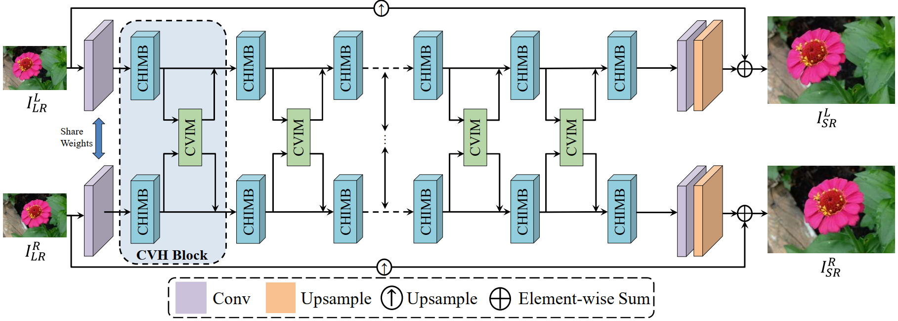
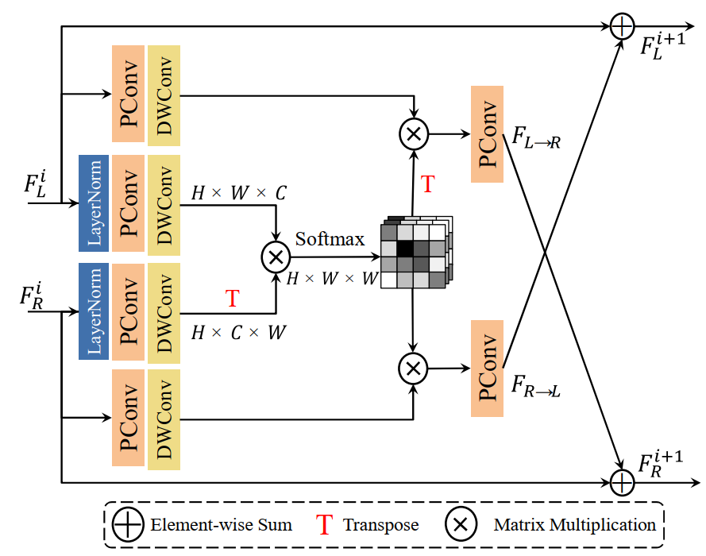

# Cross-View Hierarchy Network for Stereo Image Super-Resolution (offical)
The official pytorch implementation of the paper Cross-View Hierarchy Network for Stereo Image Super-Resolution

Wenbin Zou, Hongxia Gao* , Liang Chen, Yunchen Zhang, Mingchao Jiang, Zhongxin Yu, Ming Tan

## Introduction

We have implemented our CVHSSR method through the [NAFNet](https://github.com/megvii-research/NAFNet) algorithm framework. Next, we will describe the main processes of training and testing.

- Paper The SCET has been accepted by CVPRW2023, you can read the [paper](http://arxiv.org/abs/2304.06236) here.
- Model





## How to use the code to train CVHSSR network.
1. Installation environment
```
python 3.9.5
pytorch 1.11.0
cuda 11.3
```

```
git clone https://github.com/AlexZou14/CVHSSR
cd CVHSSR
pip install -r requirements.txt
python setup.py develop --no_cuda_ext
```
2. Data Preparation
Follow previous works, our models are trained with Flickr1024 and Middlebury datasets, which is exactly the same as <a href="https://github.com/YingqianWang/iPASSR">iPASSR</a>. Please visit their homepage and follow their instructions to download and prepare the datasets.

#### Download and prepare the train set and place it in ```./datasets/StereoSR```

#### Download and prepare the evaluation data and place it in ```./datasets/StereoSR/test```

The structure of `datasets` directory should be like
```
    datasets
    ├── StereoSR
    │   ├── patches_x2
    │   │   ├── 000001
    │   │   ├── 000002
    │   │   ├── ...
    │   │   ├── 298142
    │   │   └── 298143
    │   ├── patches_x4
    │   │   ├── 000001
    │   │   ├── 000002
    │   │   ├── ...
    │   │   ├── 049019
    │   │   └── 049020
    |   ├── test
    │   |   ├── Flickr1024
    │   │   │   ├── hr
    │   │   │   ├── lr_x2
    │   │   │   └── lr_x4
    │   |   ├── KITTI2012
    │   │   │   ├── hr
    │   │   │   ├── lr_x2
    │   │   │   └── lr_x4
    │   |   ├── KITTI2015
    │   │   │   ├── hr
    │   │   │   ├── lr_x2
    │   │   │   └── lr_x4
    │   │   └── Middlebury
    │   │       ├── hr
    │   │       ├── lr_x2
    │   │       └── lr_x4
```

3. Modify the configuration file `options/train/CVHSSR_Sx4.yml` and `options/test/CVHSSR_Sx4.yml` as follows:
```
# train
dataroot_gt: ./data/Flickr1024/trainx4 # replace your dataset path
dataroot_lq: ./data/Flickr1024/trainx4 # replace your dataset path

# Testing
dataroot_gt: ./data/Flickr1024/Stereo_test/KITTI2012/hr # replace your dataset path
dataroot_lq: ./data/Flickr1024/Stereo_test/KITTI2012/lr_x4 # replace your dataset path
pretrain_network_g: ./CVHSSR_Sx4.pth # replace your model checkpoint path
```

4. Modify the bash file `train.sh` as follows:
```
# modify the number of gpus, config path.
CUDA_VISIBLE_DEVICES=0 python -m torch.distributed.launch --nproc_per_node=1 --master_port=4329 basicsr/train.py -opt ./options/train/CVHSSR_Sx4.yml --launcher pytorch
```

5. train SCET network, as follows:
```
cd SCET

bash train.sh
```
## How to use the code to test SCET network.

```
# modify the config path, checkpoint path.
CUDA_VISIBLE_DEVICES=0 python -m torch.distributed.launch --nproc_per_node=1 --master_port=4329 basicsr/test.py -opt ./options/test/CVHSSR-S_2x.yml --launcher pytorch
```

If you find this repo useful for your research, please consider citing the papers.
```
@inproceedings{zou2023cross,
  title={Cross-View Hierarchy Network for Stereo Image Super-Resolution},
  author={Zou, Wenbin and Gao, Hongxia and Chen, Liang and Zhang, Yunchen and Jiang, Mingchao and Yu, Zhongxin and Tan, Ming},
  booktitle={Proceedings of the IEEE/CVF Conference on Computer Vision and Pattern Recognition},
  pages={1396--1405},
  year={2023}
}
```